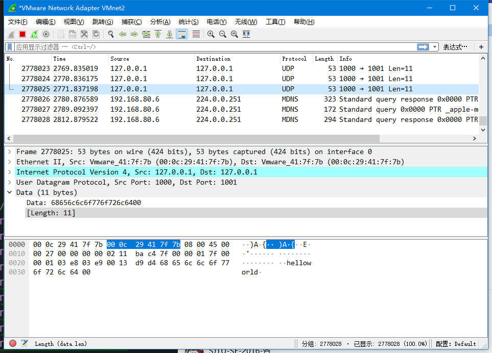
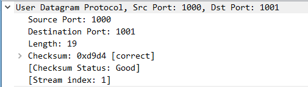
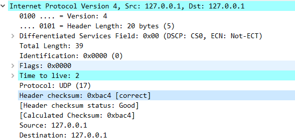

# Lab 2 - Send and Receive Packets with DPDK

Student ID: 516030910375 

Name: 蔡一凡

## Build Instructions

```shell
$ cd lab2		
$ make
$ sudo ./build/udp		# use sudo to avoid "no free hugepages" error.
```


## Part 1.
### Q1. What is the purpose of using huge page?
- Network I/O involves a large amount of data. Huge pages are used to avoid TLB miss and improve the performance.

  

### Q2. Take examples/helloworld as an example, describe the execution flow of DPDK programs.

- First, the Environment Abstraction Layer (EAL) is initialized by the `rte_eal_init` function.

- For all available cores, the `lcore_hello` function is called, which prints out a message.

  - ```c++
    RTE_LCORE_FOREACH_SLAVE(lcore_id) {
       rte_eal_remote_launch(lcore_hello, NULL, lcore_id);
    ```

- The master core also calls the function to print the message using the `lcore_hello` function.

- The master core waits for all cores to finish their tasks and then exits.

  

### Q3.  Read the codes of examples/skeleton, describe DPDK APIs related to sending and receiving packets.

- `rte_mempool_create(...)`: to create a memory pool to store message buffers.
- `rte_eth_dev_configure()`: to configure the ethernet ports.
- `rte_eth_dev_start(port)`: to start the ethernet port.
- `rte_eth_promiscuous_enable(port)`: to set to port in promiscuous mode.
- `rte_eth_rx_burst(port, 0, buf, SIZE)`: to receive a packet and store it into `buf`.
- `rte_eth_rx_burst(port, 0, buf, SIZE)`: to send a packet with data in `buf`.

### Q4. Describe the data structure of "rte_mbuf".

- The structure can be divided into the following parts:
  - Pointer to the next segment: there is a pointer `m->pkt.next` which points to the next segment in a multi-segment "rte_mbuf".
  - Headroom: the headroom contains some metadata of the "rte_mbuf", whose length can be customized.
  - Data: The data in the packet.
  - Tailroom: The rest of the "rte_mbuf".


## Part 2: Send packets with DPDK

### Program Description

- Similar to `examples/skeleton`, the port(s) is(are) initialed first, and a buffer pool is created.
- In the master core, use a message "helloworld\0" as the data to be sent.
- Following the instructions on "http://doc.dpdk.org/api", build the header for UDP, IP and Ethernet.

### Verifications

###  

- Wireshark is able to identify the packet's Ethernet, IP and UDP format. (Protocol UDP recognized by Wireshark)

- The MAC address (The real MAC address of the port), IP address (127.0.0.1) and ports (from 1000 to 1001) are correctly recognized.

- The data "helloworld\0" is correctly recognized.

- Checksums of UDP and IP are correct.

  

  

